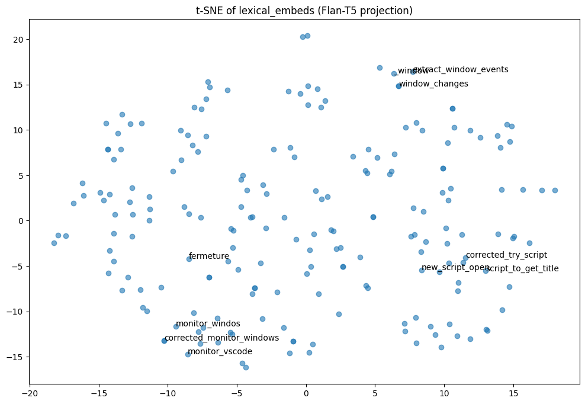
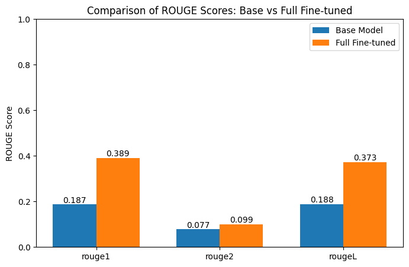

---

# 📘 Fine-tuning Flan-T5 with Lexical Embeddings

This repository documents the process of fine-tuning **`google/flan-t5-small`** to generate file descriptions from filenames, enhanced with **lexical embeddings** extracted using `SentenceTransformers`.

---

## Explanation of the process:

This project fine-tunes the **Flan-T5-small** language model to generate meaningful file descriptions from filenames.
The pipeline combines **sequence-to-sequence learning** with **lexical embeddings** to enhance semantic grounding:

1. **Dataset preparation** – filenames paired with short descriptive texts are collected in JSONL format.
2. **Lexical embeddings** – each filename is embedded using `SentenceTransformers` to capture its semantic meaning.
3. **Fusion mechanism** – embeddings are projected and injected into the Flan-T5 encoder, enriching the model’s input representation.
4. **Fine-tuning** – the model is trained on filename → description pairs with the additional lexical context.
5. **Evaluation** – performance is assessed using **ROUGE scores** and human inspection of generated outputs.

This approach improves the model’s ability to **understand filenames and generate more natural, context-aware descriptions**, compared to a base Flan-T5 model without lexical embeddings.


# ⚙️ 1. Installation

---

### 1️⃣ Core Deep Learning

```bash
!pip install --disable-pip-version-check \
  torch==2.8.0 \
  torchdata==0.11.0 --quiet
```

* **torch==2.8.0** → The main deep learning framework (PyTorch) used for defining and training neural networks, handling GPU acceleration, and managing tensors.
* **torchdata==0.11.0** → Provides efficient tools for **loading, streaming, and transforming datasets**, especially useful for large-scale or custom datasets.
* **--disable-pip-version-check** → Avoids checking for pip updates, which speeds up installation in notebooks.
* **--quiet** → Minimizes output logs during installation.

---

### 2️⃣ Transformers & NLP Fine-tuning

```bash
!pip install \
  transformers==4.44.2 \
  rouge_score==0.1.2 \
  loralib==0.1.1 \
  peft==0.3.0 --quiet
```

* **transformers==4.44.2** → Hugging Face library for working with pre-trained models like T5, GPT, and BERT. Required for **loading models, tokenization, generation, and fine-tuning**.
* **rouge_score==0.1.2** → Computes **ROUGE metrics**, which measure the quality of generated text (important for evaluating your fine-tuned model).
* **loralib==0.1.1** → Provides **LoRA (Low-Rank Adaptation)**, a method to fine-tune large models efficiently with fewer parameters.
* **peft==0.3.0** → Parameter-Efficient Fine-Tuning library, integrates LoRA and other techniques to fine-tune large models without retraining everything.

---

### 3️⃣ Cloud Storage & Command-line Tools

```bash
!pip install awscli
```

* **awscli** → Command-line interface for **Amazon Web Services (S3, EC2, etc.)**. Useful if you want to **download/upload datasets or model checkpoints** to AWS.

---

### 4️⃣ Dataset Evaluation

```bash
!pip install evaluate
```

* **evaluate** → Hugging Face library for computing **metrics like ROUGE, BLEU, accuracy, etc.**. Used to quantitatively evaluate your generated file descriptions.

---

### 5️⃣ Dataset Handling

```bash
!pip install --upgrade datasets==4.1.0
!pip install "pyarrow>=14.0.0,<20.0.0" --force-reinstall
```

* **datasets==4.1.0** → Hugging Face library to **load, split, preprocess, and manage datasets** (JSON, CSV, Parquet, etc.).
* **pyarrow** → Backend required by `datasets` to efficiently read/write data formats like **Arrow, Parquet, or JSONL**.
* **--force-reinstall** ensures **compatibility between `datasets` and `pyarrow`**.

---

### 6️⃣ Semantic Embeddings

```bash
!pip install -U sentence-transformers
```

* **sentence-transformers** → Generates **sentence or text embeddings**, which are used to **capture semantic information** of filenames and descriptions, helping the model understand their meaning.

---

✅ **In short:** These installations set up a **full environment for deep learning, dataset handling, semantic embeddings, model fine-tuning, evaluation, and cloud integration**. Each library plays a crucial role in a stage of the pipeline, from preprocessing to evaluation.


---

# 📂 2. Dataset Preparation

---

### **Why we need this step**

Before training any model, we need to have **structured data** in a format that the model can understand. In this case, we are using a **JSONL file** (`file_description.jsonl`) where each line is a JSON object containing:

* `id` → Unique identifier for the file entry.
* `filename` → The name of the file we want to describe.
* `file_desc` → A short text description explaining what the file likely contains.

This structure allows us to **pair input (`filename`) with the target output (`file_desc`)** for supervised learning. Essentially, the model will learn to generate `file_desc` when given a `filename`.

---

### **What the code does**

```python
from datasets import load_dataset

my_dataset = "/content/drive/MyDrive/file_description.jsonl"

dataset = load_dataset(
    "json",
    data_files=my_dataset,
    split={
        "train": "train[:85%]",
        "validation": "train[85%:95%]",
        "test": "train[95%:]"
    }
)
print(dataset)
```

1. **`load_dataset("json", ...)`**

   * Loads the dataset from a JSON or JSONL file.
   * Converts it into a `DatasetDict` object with features and rows easily accessible for preprocessing and training.

2. **`split={...}`**

   * Automatically divides the dataset into **train, validation, and test sets**:

     * `train[:85%]` → 85% of examples for training.
     * `train[85%:95%]` → 10% for validation (used to monitor the model’s performance during training).
     * `train[95%:]` → 5% for testing (used to evaluate final performance).

3. **Output (`DatasetDict`)**

   ```text
   DatasetDict({
       train: Dataset({features: ['id', 'filename', 'file_desc'], num_rows: 1707}),
       validation: Dataset({features: ['id', 'filename', 'file_desc'], num_rows: 201}),
       test: Dataset({features: ['id', 'filename', 'file_desc'], num_rows: 100})
   })
   ```

   * Shows that the dataset is successfully loaded and split.
   * Each subset maintains the same features (`id`, `filename`, `file_desc`).
   * Number of rows matches the expected split.

---

### **Summary**

This step is **crucial** because it:

1. Loads the dataset into memory in a format compatible with Hugging Face models.
2. Ensures **consistent training/validation/testing splits**, which is essential for evaluating model performance fairly.
3. Prepares the data for **further preprocessing**, like tokenization and embedding generation.

Without this step, the model would not know which inputs correspond to which outputs, and training would not be possible.

---

## 🧠 3. Model & Tokenizer Loading

---

### **Sequence-to-Sequence Model: `google/flan-t5-small`**

```python
from transformers import AutoModelForSeq2SeqLM, AutoTokenizer

model_name = "google/flan-t5-small"
original_model = AutoModelForSeq2SeqLM.from_pretrained(model_name, torch_dtype=torch.bfloat16)
tokenizer = AutoTokenizer.from_pretrained(model_name)
```

* **Type:** Sequence-to-Sequence (Seq2Seq) model.
* **Purpose:** Designed to **generate text based on an input prompt**, making it suitable for tasks like text summarization, translation, or, in this pipeline, generating file descriptions from filenames.
* **Size and configuration (`flan-t5-small`):**

  * Hidden size (`d_model`): 512
  * Number of layers: 8
  * Number of attention heads: 6
  * Feed-forward size: 1024
  * Vocabulary size: 32,128 tokens
* **Tokenizer:** Converts text into input token IDs that the model can understand.

---

### **Lexical Embedding Model: `all-MiniLM-L6-v2`**

```python
from sentence_transformers import SentenceTransformer

lex_model = SentenceTransformer("all-MiniLM-L6-v2")
embedding_dim = lex_model.get_sentence_embedding_dimension()  # 384
print("Lexical embedding dim:", embedding_dim)
```

* **Type:** Sentence embedding model.
* **Purpose:** Produces **dense vector embeddings** representing the **semantic meaning** of text (here, filenames). These embeddings are later projected to the T5 hidden space to **enhance the model with lexical/semantic information**.
* **Output size:** 384-dimensional vectors (per sentence or filename).

---

### **Summary of Roles**

| Model              | Purpose                                  | Output Size              |
| ------------------ | ---------------------------------------- | ------------------------ |
| `flan-t5-small`    | Generate descriptive text from filenames | Hidden size: 512         |
| `all-MiniLM-L6-v2` | Capture semantic meaning of filenames    | Embedding dimension: 384 |

* The lexical embeddings are later **projected to match the T5 hidden size (512)**, allowing the Seq2Seq model to use both the filename’s text and its semantic representation during training and generation.


---

# 🔄 4. Preprocessing Pipeline

---

### **1. Projection to T5 dimension**

```python
config = T5ForConditionalGeneration.from_pretrained(model_name).config
hidden_size = config.d_model  # 512 for flan-t5-small

proj_layer = nn.Linear(embedding_dim, hidden_size)
```

* **Why:** The lexical embeddings produced by the sentence-transformer model (`all-MiniLM-L6-v2`) have **dimension 384**, but the T5 model’s hidden size is **512**.
* **What it does:**

  * `nn.Linear(embedding_dim, hidden_size)` is a **projection layer** that maps the 384-dimensional lexical embeddings to 512 dimensions.
  * This allows us to **inject semantic information** about the filename directly into the T5 model’s latent space.

---

### **2. Tokenization + Lexical Embedding Injection**

```python
def tokenize_function(example):
    filename = example["filename"]
    file_desc = example["file_desc"]

    # Lexical embeddings
    filename_embedding = torch.tensor(lex_model.encode(filename)).float()
    filename_proj = proj_layer(filename_embedding)
    filename_proj = filename_proj / filename_proj.norm()  # normalization

    # Prompt
    prompt = f"""
    Given the following filename, generate a short description of what the file is likely about.

    Filename: {filename}

    Description:
    """

    tokenized_inputs = tokenizer(prompt, padding="max_length", truncation=True, max_length=128)
    tokenized_labels = tokenizer(file_desc, padding="max_length", truncation=True, max_length=128)

    tokenized_inputs["labels"] = tokenized_labels["input_ids"]
    tokenized_inputs["lexical_embeds"] = filename_proj.detach().numpy().astype("float32").tolist()
    return tokenized_inputs
```

**Explanation of the steps:**

1. **Lexical Embeddings**

   * Encode the filename into a semantic vector using `lex_model`.
   * Project it to match the T5 hidden size using `proj_layer`.
   * Normalize the vector to have unit norm (helps stabilize training).

2. **Prompt Creation**

   * A textual prompt is built: `"Given the following filename, generate a short description..."`
   * This provides context for the Seq2Seq model to generate the description.

3. **Tokenization**

   * Convert the prompt and target description into **token IDs** suitable for T5.
   * `tokenized_inputs["labels"]` is used as the **target output** during training.

4. **Inject Lexical Embeddings**

   * The projected lexical embedding is added to the tokenized inputs as `"lexical_embeds"`.
   * Later, during training, this embedding can be integrated into the model (e.g., concatenated or added to T5 encoder states) to enrich the model’s input with semantic info about the filename.

---

### **3. Apply to dataset**

```python
tokenized_datasets = dataset.map(tokenize_function, batched=False)
tokenized_datasets = tokenized_datasets.remove_columns(['id', 'filename', 'file_desc'])
```

* **What it does:**

  * Maps each example in the dataset through `tokenize_function`.
  * Removes original columns to keep only **`input_ids`, `attention_mask`, `labels`, `lexical_embeds`**, which are needed for training.

**Output after mapping:**

```
Map: 100%
  1707/1707 [00:45<00:00, 39.32 examples/s]
Map: 100%
  201/201 [00:03<00:00, 60.36 examples/s]
Map: 100%
  100/100 [00:02<00:00, 56.51 examples/s]
Training: (1707, 4)
Validation: (201, 4)
Test: (100, 4)
DatasetDict({
    train: Dataset({
        features: ['input_ids', 'attention_mask', 'labels', 'lexical_embeds'],
        num_rows: 1707
    })
    validation: Dataset({
        features: ['input_ids', 'attention_mask', 'labels', 'lexical_embeds'],
        num_rows: 201
    })
    test: Dataset({
        features: ['input_ids', 'attention_mask', 'labels', 'lexical_embeds'],
        num_rows: 100
    })
})
```

* Shows **successful tokenization and embedding injection**.
* Confirms each split has 4 features:

  1. `input_ids` – tokenized prompt
  2. `attention_mask` – mask for padding
  3. `labels` – tokenized target description
  4. `lexical_embeds` – projected filename embeddings

---

✅ **In short:** This process **augments T5’s text input with semantic information** about the filenames, helping the model generate more accurate descriptions by combining **lexical meaning** and **text context**.

---

# 🔍 5. Embedding Evaluation

We check **consistency** and **semantic clustering**:

* **Cosine Similarity** (same vs different filenames)
* **t-SNE Visualization**

```python
print("Average similarity same filename :", np.mean(same_sims))
print("Average similarity filename different :", np.mean(diff_sims))
```

✅ Output:

```
Average similarity same filename : 1.0
Average similarity filename different : 0.64
```
```
Similarity filename modified : 0.86637294
```
t-SNE clusters similar filenames together.

---

# 🏗 6. Model with Fusion Layer
---

This code extends **Flan-T5**, a sequence-to-sequence language model, to incorporate **lexical embeddings** derived from filenames. The idea is that filenames often contain meaningful semantic cues (e.g., `app_config`, `user_data`) that can help the model generate more accurate file descriptions.

By fusing these embeddings with the T5 encoder’s token embeddings, the model can leverage both:

1. **Contextual understanding from Flan-T5** (learned language patterns, general knowledge).
2. **Lexical semantic information** from filenames (specific hints about the file content).

This fusion improves the model’s ability to generate precise and relevant descriptions, especially in datasets where textual descriptions are short and filenames carry significant information.

---

### **Explanation of the Code**

```python
class T5WithFusion(nn.Module):
    def __init__(self, model_name="google/flan-t5-small", lexical_dim=512):
        super().__init__()
        self.t5 = T5ForConditionalGeneration.from_pretrained(model_name)
        self.proj = nn.Linear(lexical_dim, self.t5.config.d_model)
```

* `self.t5` loads the pre-trained Flan-T5 model.
* `self.proj` is a linear layer that **projects lexical embeddings** (e.g., 512-dim from SentenceTransformer) to the **hidden size of T5** (`d_model`), ensuring compatibility for addition.

---

```python
def forward(self, input_ids=None, attention_mask=None, labels=None, lexical_embeds=None, **kwargs):
    inputs_embeds = self.t5.encoder.embed_tokens(input_ids)
```

* Converts token IDs (`input_ids`) into embeddings using T5’s encoder.

---

```python
if lexical_embeds is not None:
    lexical_proj = self.proj(lexical_embeds.float()).to(inputs_embeds.device)
    inputs_embeds = inputs_embeds + lexical_proj.unsqueeze(1)
```

* **Projects lexical embeddings** into T5’s hidden space.
* `unsqueeze(1)` adds a sequence dimension so it can be **added to each token embedding**.
* This effectively **fuses filename information into the token embeddings**, providing extra context for the encoder.

---

```python
return self.t5(input_ids=None, attention_mask=attention_mask, labels=labels, inputs_embeds=inputs_embeds, **kwargs)
```

* Calls the original T5 model using `inputs_embeds` instead of `input_ids`.
* Training proceeds as usual, but now the model **sees both token embeddings and lexical cues** simultaneously.

---

✅ **Summary:**
This module allows your Flan-T5 model to leverage **additional lexical information** without modifying the core architecture. It’s crucial for tasks where filenames provide strong semantic hints, improving downstream description generation accuracy.

---

# 📦 7. Data Collator
---

### **Purpose of `DataCollatorWithFusion`**

In a PyTorch/Transformers training pipeline, a **data collator** is responsible for **combining multiple dataset examples into a single batch**.

`DataCollatorWithFusion` extends this concept to handle **both the standard token inputs for T5 and the additional lexical embeddings** that we fused into the model. Its main function is to ensure that each batch is **properly formatted as tensors** for model training.

---

### **Step-by-Step Explanation**

```python
class DataCollatorWithFusion:
    def __init__(self, tokenizer):
        self.tokenizer = tokenizer
```

* Initializes the collator with a **tokenizer**, needed to handle special tokens (e.g., `pad_token_id`).

---

```python
def __call__(self, batch):
    input_ids = torch.stack([torch.tensor(x["input_ids"], dtype=torch.long) for x in batch])
    attention_mask = torch.stack([torch.tensor(x["attention_mask"], dtype=torch.long) for x in batch])
    labels = torch.stack([torch.tensor(x["labels"], dtype=torch.long) for x in batch])
```

* Converts each field (`input_ids`, `attention_mask`, `labels`) in the batch from a list of individual examples into **batched PyTorch tensors**.
* `torch.stack` creates a new dimension for the batch.

---

```python
labels[labels == self.tokenizer.pad_token_id] = -100
```

* T5 ignores positions where the label is `-100` during loss computation.
* Replace padding token IDs in `labels` with `-100` to **prevent the model from learning from padding tokens**.

---

```python
lexical_embeds = torch.stack([torch.tensor(x["lexical_embeds"], dtype=torch.float32) for x in batch])
```

* Converts the **lexical embeddings** for each example into a batched tensor.
* This ensures the extra embeddings are aligned with the `input_ids` for fusion in the T5 model.

---

```python
return {
    "input_ids": input_ids,
    "attention_mask": attention_mask,
    "labels": labels,
    "lexical_embeds": lexical_embeds,
}
```

* Returns a dictionary with all tensors **ready for the model’s forward pass**.
* Matches the signature expected by the `T5WithFusion` model, including the custom `lexical_embeds`.

---

### ✅ **Summary**

* The `DataCollatorWithFusion` **prepares batches for training** Flan-T5 with lexical embedding fusion.
* Handles both standard text inputs and additional semantic cues.
* Ensures labels are masked properly, preventing padding from affecting training.

---

# 🚀 8. Training

---

### **Purpose**

This code sets up and runs the **training of your T5 model with fused lexical embeddings**. It uses the Hugging Face `Trainer` API, which handles batching, optimization, evaluation, and logging automatically.

---

### **Step-by-Step Explanation**

```python
from transformers import Trainer, TrainingArguments
```

* Imports Hugging Face classes to configure training parameters (`TrainingArguments`) and to manage the training loop (`Trainer`).

---

```python
training_args = TrainingArguments(
    output_dir="/content/drive/MyDrive/Gen_Desc_Model/results_full",
    num_train_epochs=10,
    per_device_train_batch_size=8,
    per_device_eval_batch_size=8,
    learning_rate=5e-5,
    evaluation_strategy="epoch",
    save_strategy="epoch",
    logging_steps=10,
    fp16=False,
    remove_unused_columns=False
)
```

* **`output_dir`**: Where model checkpoints and logs are saved.
* **`num_train_epochs`**: Number of full passes over the training dataset (10 epochs).
* **`per_device_train_batch_size` / `per_device_eval_batch_size`**: Batch size for training and validation per GPU/CPU.
* **`learning_rate`**: Optimization step size (small to stabilize fine-tuning).
* **`evaluation_strategy="epoch"`**: Evaluate on the validation set at the end of each epoch.
* **`save_strategy="epoch"`**: Save model checkpoints after each epoch.
* **`logging_steps=10`**: Log metrics every 10 steps.
* **`fp16=False`**: Disables mixed-precision; could be enabled on GPUs for speed.
* **`remove_unused_columns=False`**: Keeps extra columns (like `lexical_embeds`) for custom collators.

---

```python
model = T5WithFusion(model_name=model_name)
collator = DataCollatorWithFusion(tokenizer)
```

* Instantiates your **T5 model with lexical embedding fusion**.
* Creates a **data collator** to batch inputs including both token IDs and lexical embeddings.

---

```python
trainer = Trainer(
    model=model,
    args=training_args,
    train_dataset=tokenized_datasets["train"],
    eval_dataset=tokenized_datasets["validation"],
    data_collator=collator,
)
```

* Configures the `Trainer` with:

  * Your fused model.
  * Training arguments.
  * Training and validation datasets.
  * Custom collator to handle the extra embeddings.

---

```python
trainer.train()
```

* Starts the **training loop**: forward pass → loss computation → backpropagation → optimization → evaluation → checkpoint saving.
* The trainer handles batching, shuffling, and GPU/CPU execution automatically.

---

### **Training Logs Example**

```
Epoch	Training Loss	Validation Loss
1	1.7604	1.8481
2	1.4455	1.7424
...
10	1.0089	1.6482
```

* Shows **training loss decreasing**, meaning the model is learning to map filenames to descriptions.
* Validation loss provides an estimate of how well the model generalizes to unseen data.

---

✅ **Summary**

* This block of code **trains the lexical-fusion T5 model on your dataset**.
* It combines the text token inputs with semantic embeddings to improve file description generation.
* The Hugging Face `Trainer` API simplifies training, evaluation, and checkpointing.

---

## 💾 9. Save & Reload

```python
trainer.save_model("/content/drive/MyDrive/Gen_Desc_Model/full_finetuned")
tokenizer.save_pretrained("/content/drive/MyDrive/Gen_Desc_Model/full_finetuned")
```

---

## 🧪 10. Evaluation

### Qualitative (example)

```python
filename = "app_config"
# → Gold: "configuration settings for an application"
# → Predicted (fine-tuned): "It likely contains configuration settings for a system or application."
```

### Quantitative (ROUGE)

---

### **ROUGE Scores Comparison**

**Base Model ROUGE:**

```python
{'rouge1': 0.187, 'rouge2': 0.077, 'rougeL': 0.188, 'rougeLsum': 0.188}
```

**Full Fine-tuned Model ROUGE:**

```python
{'rouge1': 0.389, 'rouge2': 0.099, 'rougeL': 0.373, 'rougeLsum': 0.373}
```

* **Interpretation:** The base model, without fine-tuning, performs moderately on generating file descriptions, achieving low ROUGE scores (ROUGE-1 ~18%, ROUGE-2 ~8%).
* After fine-tuning on your dataset with lexical embeddings, the model significantly improves across all ROUGE metrics.

---

### **Absolute Percentage Improvement**

```
rouge1: 20.29%
rouge2: 2.14%
rougeL: 18.53%
rougeLsum: 18.52%
```
This is a schema to represent it :


* This shows how much the fine-tuned model improved **in absolute terms** compared to the base model.
* For example, ROUGE-1 increased by ~20%, meaning the model now captures a much higher overlap of unigrams with reference descriptions.

---

### **Percentage Difference / Gain Analysis**

```
rouge1: +20.29% (gain)
rouge2: +2.14% (gain)
rougeL: +18.53% (gain)
rougeLsum: +18.52% (gain)
```

* This confirms that the fine-tuned model outperforms the base model in all evaluated metrics.
* The most significant gain is in **ROUGE-1**, which measures unigram overlap, indicating that the model generates more relevant words in its descriptions.
* ROUGE-2 improvement is smaller, showing that exact bigram matches are harder to improve, but there is still a noticeable gain.
* ROUGE-L and ROUGE-Lsum improvements demonstrate better alignment in sequence-level and summary-level structure with reference descriptions.

---

✅ **Summary:** Fine-tuning with your dataset and lexical embeddings **substantially improves the model's ability to generate accurate and meaningful file descriptions**, especially in capturing individual words and overall structure.

---

## ✅ Conclusion

* The fusion of **lexical embeddings** improves semantic grounding of generated descriptions.
* The model captures filename semantics better than the base Flan-T5.
* Next step: extend with **LoRA** or **PEFT** for lighter fine-tuning.

---
